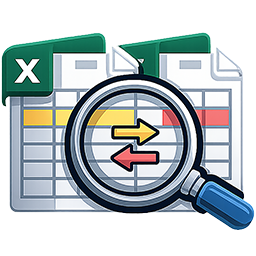

# Hi, I'm Cyril 👋

You can call me **Cy** for short. 😊

Electronics Engineer with experience in semiconductor test engineering, engineering automation, and AI-assisted software development. Currently pursuing a Master of Data Analytics in New Zealand, with a passion for building data-driven applications, desktop software, and intelligent automation solutions.

---

## 🏅 Highlights

- 🥇 **1st Runner-Up** — TI Philippines New Wave Summit 2026
- 🥈 **2nd Runner-Up** — TI Clark Technical Symposium 2025
- 🎤 **Best Presenter Award** — TI Clark Technical Symposium 2025
- 🏆 **Poster Awardee** — TI Philippines Technical Conference 2025
- 🎓 **Master of Data Analytics** (Current) — New Zealand Skills and Education Group
- 💼 Former Semiconductor Test Engineer at Texas Instruments
  
---

## 🔨 Featured Projects

<h3>
  
   SheetDiff
  
</h3>

**Python • CustomTkinter • OpenPyXL • tksheet**

A Python desktop application for comparing Excel spreadsheets side-by-side. Designed for engineers, analysts, and data professionals, it automatically detects added, deleted, and modified data, highlights differences visually, and generates comparison reports to streamline spreadsheet reviews.

---

<h3>
  ⚒️ QueryForge
  
</h3>

**Python • SQLite • CustomTkinter • OpenPyXL • tksheet**

A modern SQL Query Builder and Database Explorer built with Python, SQLite, and CustomTkinter. It enables users to visually build SQL queries, explore database schemas, execute queries, and export results to Excel.

---

## 🚀 Technical Stack

### 💻 Languages

### 📊 Data Analytics

### 🗄️ Data Engineering

### 🔬 Engineering Test Systems

  
---

## 🌱 Currently Exploring

---
## 🔨 Future Projects

### AI Data Assistant *(In Development)*
An AI-powered application that analyzes uploaded datasets and answers questions using natural language.

### Data Analytics Dashboard *(Planned)*
Interactive dashboard for visualizing trends, KPIs, and business insights.

### Resume Job Matcher *(Planned)*
AI-assisted tool that compares resumes against job descriptions and identifies skill gaps.

---

## 🔒 Professional & Research Projects

The following projects were developed in professional and research environments. Due to confidentiality, intellectual property, and NDA restrictions, source code and implementation details cannot be publicly shared.

### 🤖 ShellGPT
**AI-Based Eagle Shell Debug Assistant**

Designed an AI-assisted debugging and knowledge-support solution to accelerate troubleshooting, improve developer productivity, and simplify access to engineering knowledge.

**Recognition**
- TI Philippines New Wave Summit 2026
- 1st Runner-Up

---

### 🏆 TestMate
**Test Methodology Automated Tool Extractor for ETS 364 Programs**

Developed an engineering automation tool that extracts and analyzes test methodology information from structured test programs, helping improve engineering efficiency and reporting workflows.

**Recognition**
- TI Clark Technical Symposium 2025
- 2nd Runner-Up
- Best Presenter Award

---

### 🏆 NxtTest
**Next Execution Translation Test Tool**

Developed a solution to assist in translating and migrating test resources between engineering test environments, reducing manual effort and improving consistency.

**Recognition**
- TI Philippines Technical Conference 2025
- Poster Awardee

---

### 🚀 Cad2Code
**Engineering the Future of Loadboard Validation Through Automated LBC Check Code**

Developed automation concepts to improve loadboard validation workflows and engineering productivity through automated verification techniques.

**Presented At**
- TI Philippines New Wave Summit 2026

---

### 🚀 GUIDE
**Gateway to Unified Information for Device Ecosystem**

Designed a centralized platform concept to improve accessibility, organization, and sharing of engineering information across teams and device ecosystems.

**Presented At**
- TI Philippines New Wave Summit 2026

---

## 🔬 Domain Expertise

- Semiconductor Test Engineering
- Automated Test Equipment (ATE)
- Engineering Automation
- Test Program Analysis
- Data Extraction & Reporting
- Process Optimization
- AI-Assisted Engineering Tools

---

## 🎯 Career Goals

- Build impactful software and analytics solutions
- Advance expertise in Data Analytics and Artificial Intelligence
- Contribute to innovative engineering and software projects
- Continuously learn and grow as an engineer and developer

---

## 📫 Connect With Me

---
<!--
## 🛠️ Technologies

---
-->
> *Building intelligent software and data-driven solutions that transform complex engineering challenges into real-world impact.*

